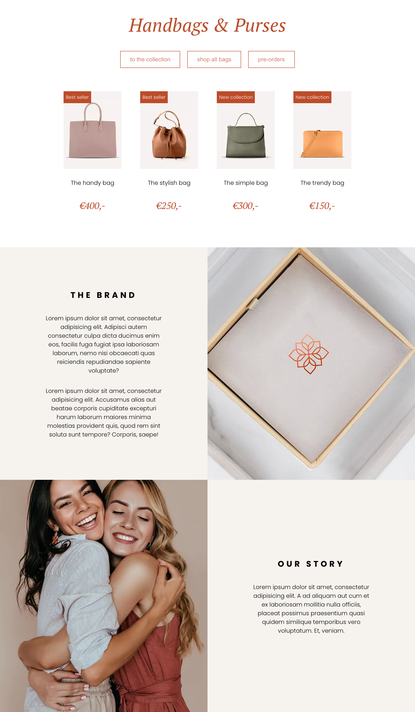

# 👜 Expensive Bags Store – NOVI Frontend Module

This repository contains my solution for the **Expensive Bags Store** exercise from the Frontend Development module at [Novi University](https://www.novi.nl).  
The goal of this assignment is to practice working with **React components** and **props** by refactoring a webshop into reusable, data-driven components without changing the visual design.

The focus is on creating flexible, reusable UI building blocks such as **Buttons**, **Products**, and **Tiles**, while maintaining existing styling through semantic HTML elements.

---

## Table of Contents

- [Tech Stack](#tech-stack)
- [Key Features](#key-features)
- [Preview](#preview)
- [Project Setup](#project-setup)
- [Credits](#credits)
- [License](#license)

---

## Tech Stack

- **React** (v18.2.0)
- **Vite**
- **HTML5**
- **CSS3**
- **JavaScript ES6+**
- **Node.js** & **NPM**

---

## Key Features

### 🔘 Reusable Buttons
- Three navigational buttons wrapped in a `<nav>` element.
- Click handlers log the button label to the console.
- Support for **disabled** state.
- Refactored into a **`Button` component** receiving:
    - Button text
    - Click handler
    - Disabled state

### 🛍 Product Cards
- Displayed inside a `<main>` container.
- Each product shows:
    - Red sale label
    - Product image
    - Product name
    - Price
- Refactored into a **`Product` component** receiving:
    - Label text
    - Image source
    - Product name
    - Price

### 🪧 Tiles
- Displayed in a `<footer>` container.
- Supports **image tiles** (brand/designer logos) and **text tiles** (title + paragraphs).
- Flexible structure allowing:
    - Any number of paragraphs
    - Conditional rendering:
        - With image → image tile
        - Without image → text tile
- Refactored into a **`Tile` component** receiving:
    - Optional image source
    - Optional title
    - Paragraph array

---

## Preview



> The UI remains visually identical to the original webshop, but the underlying code is refactored into reusable, prop-driven React components.

---

## Project Setup

1. Clone or open the repository in an IDE

2. Install dependencies
   ```bash
   npm install
   ```
3. Start the development server
   ```bash
   npm run dev
   ```
4. Open your browser at http://localhost:5173 to view the app.


## Credits

> This assignment, visual designs and base project setup were created and provided by **Novi University** as part of the Frontend module.

---

## License

> "This project is for **educational purposes only**. All images, designs, and dummy content are to be used for learning and non-commercial use."

---